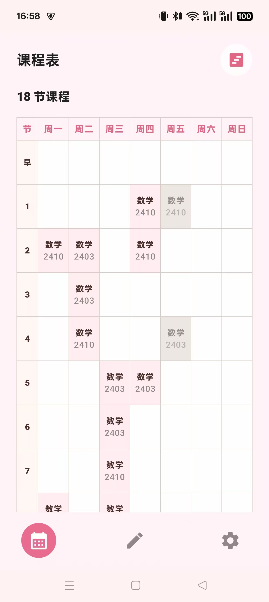
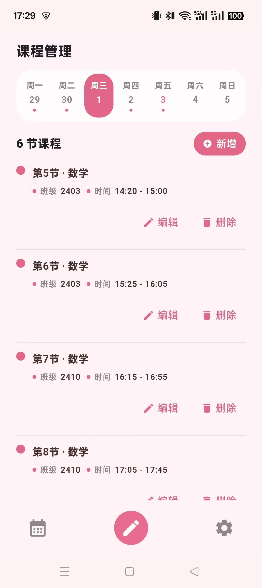
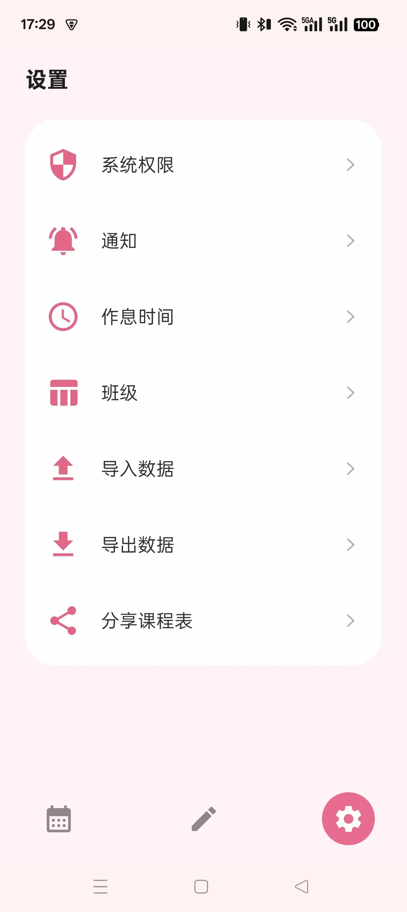

# 湘约一课

湘约一课是一款面向教师和学生的 Android 课程表应用，用于管理每周课程、作息时间、班级预设和上课提醒。应用采用 Jetpack Compose 构建，重点优化了锁屏通知、前台常驻今日课程、提示音、震动和闹钟提醒等移动端场景。

## 应用截图

| 课程表 | 课程管理 | 设置 |
| --- | --- | --- |
|  |  |  |

## 功能特性

- 课程表视图：支持时间线和表格两种查看方式，按日期展示当天课程。
- 课程管理：新增、编辑、删除课程，自动校验同一作息节次的冲突。
- 班级预设：可在设置中维护常用班级，新增课程时直接选择，也可以手动填写。
- 作息时间：支持多套作息表，设置当前作息表，并维护早读、正课、晚自习等时间段。
- 今日课程通知：前台常驻显示今日最近课程，并在“距离上课”后展示倒计时。
- 上课提醒：支持关闭通知、闹钟提醒、震动提醒、提示音提醒和提前提醒分钟数。
- 提示音试听：内置多种 OGG 提示音，可在通知设置中试听并选择。
- 锁屏通知：提醒通知使用公开可见通知，便于在锁屏界面展示上课提醒。
- 数据导入导出：支持导出 JSON 数据文件，也支持从系统分享、文件管理器或微信打开数据文件导入。
- 课程表分享：可生成课程表图片并分享到微信、QQ 等应用。

## 权限说明

为了保证上课提醒在息屏、锁屏和后台场景中尽量准时工作，应用会根据功能请求以下权限：

- 通知权限：用于在通知栏和锁屏界面显示“上课提醒”和“今日课程”。
- 精确闹钟权限：用于按课程时间准时触发提醒。
- 震动权限：用于开启“震动提醒”后到点震动。
- 前台服务权限：用于维持今日课程通知和后台提醒守护。
- 忽略电池优化：用于减少部分系统在息屏后延迟或停止后台提醒的情况。
- 开机自启动相关设置：部分国产 ROM 需要手动允许后台运行或自启动，应用会引导到对应系统设置页。

通知功能依赖系统允许应用在后台运行。若未允许后台运行、自启动或忽略电池优化，息屏、锁屏或切换到其他应用后，可能出现今日课程通知不更新、上课提醒延迟、提醒不响等功能异常。

如果通知功能无法正常使用，请先进入“设置 - 系统权限”，按页面提示完成必要授权，再返回“设置 - 通知”开启需要的提醒方式。

## 技术栈

- Kotlin
- Jetpack Compose
- Material 3
- Android AlarmManager
- Android Foreground Service
- WorkManager
- Apache POI

## 开发环境

- Android Studio
- JDK 17
- Android Gradle Plugin 对应项目 Gradle 配置
- compileSdk 34
- minSdk 26
- targetSdk 34

## 本地构建

调试包：

```powershell
.\gradlew.bat assembleDebug "-Pkotlin.incremental=false"
```

正式包：

```powershell
.\gradlew.bat assembleRelease "-Pkotlin.incremental=false"
```

本地 Kotlin 增量编译缓存偶尔可能出现缓存损坏提示，建议在验证构建时带上 `-Pkotlin.incremental=false`。

## Release 签名

正式签名信息可放在 `local.properties`、Gradle property 或环境变量中：

```properties
RELEASE_STORE_FILE=your-release-key.jks
RELEASE_STORE_PASSWORD=your-store-password
RELEASE_KEY_ALIAS=your-key-alias
RELEASE_KEY_PASSWORD=your-key-password
```

缺少正式签名配置时，Gradle 仍可执行 release 构建流程，但生成包是否可安装取决于本地 Android 构建环境和签名配置。

## 当前版本

- 首个 Git 发布版本：`v1.2`
- Android versionName：`1.2`
- Android versionCode：`3`

## 许可证

本项目使用 MIT License，详见 [LICENSE](LICENSE)。
